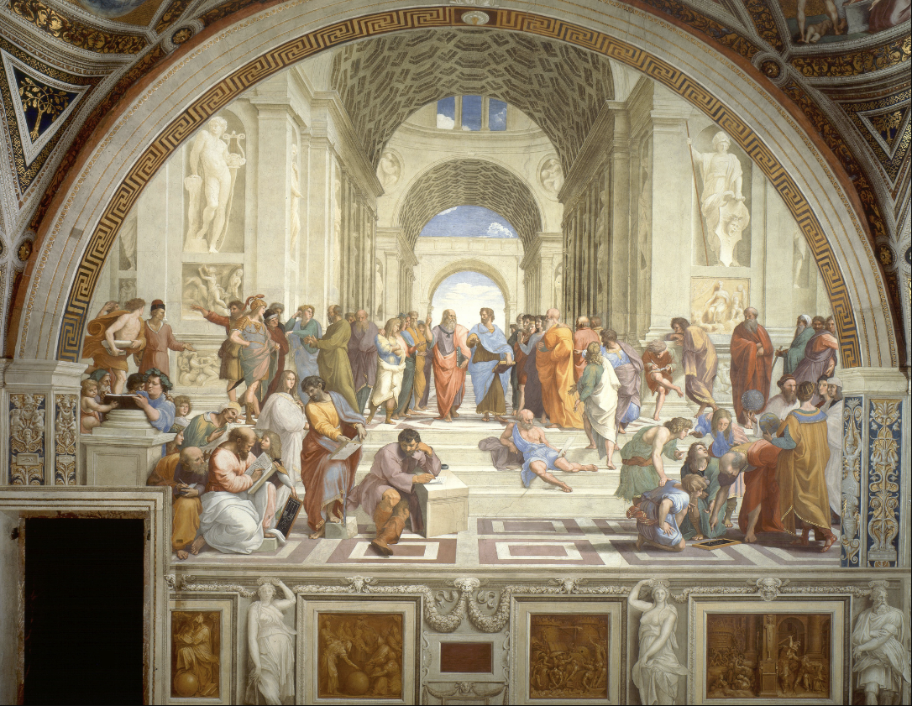
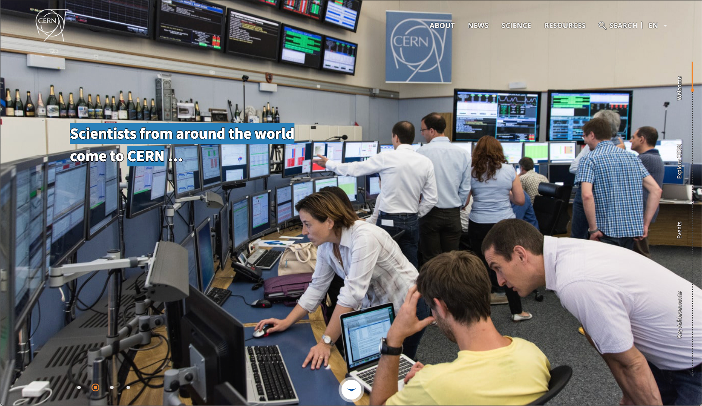
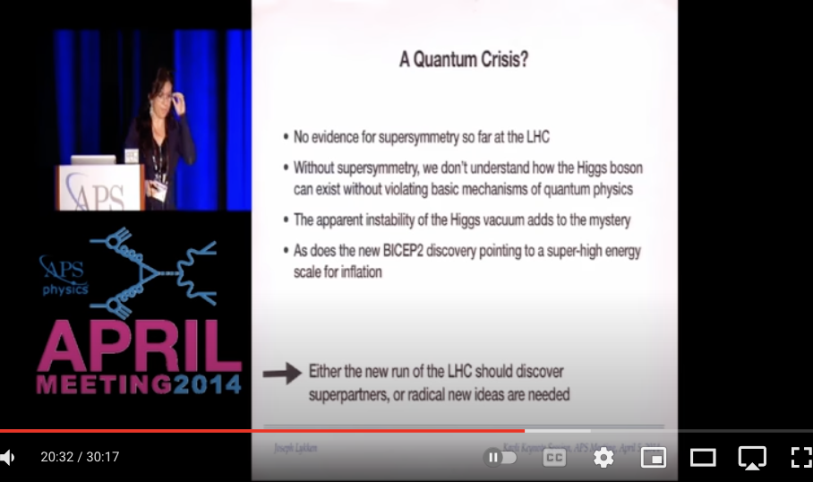
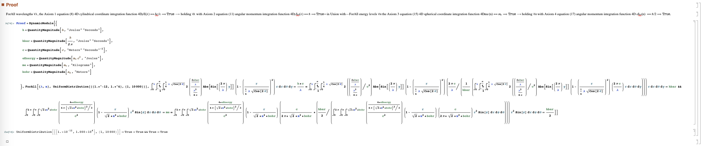

### AI Peer Review of Standard Model of Physics vs 4D GEM EOS via ChatGPT-Wolfram Plugin

**abstract**

AI peer review prompt for an ai-worldview in the [2023 Kaggle AI Report Competition](https://www.kaggle.com/competitions/2023-kaggle-ai-report/overview) is generated for ChatGPT-Wolfram to select higher-accuracy computational reproduction of 4D spacetime human-ai experience between [Standard Model of Physics (SM)](https://home.cern/science/physics/standard-model)-[Supersymmetry (_SUSY_)](https://en.wikipedia.org/wiki/Supersymmetry) vs [4D spatially-exended gravitoelectromagnetic equation of state (4D GEM EOS) photon-electron soliton gauge group](https://www.researchgate.net/publication/358283851_Spatially-Extended_4D_Photon_and_Electron_ForAll_Wavelengths_Energy_Levels). Wherein 4D GEM EOS Mathematica® theorem proving operator computationally reproduces `ForAll` wavelengths and energy levels the quantum mechanical observables to all 31 and 34 decimal places in units of _pascals_ along the perfect fluid metric pressure trace of **T** being the total field spin-stress energy momentum density tensor pressure of the 4D cylindrical spacetime human-ai experienced universe exceeding the requirements of the [Yang-Mills-Navier-Stokes problem definitions](https://www.claymath.org/millennium-problems/). Subject area of present human-ai fundamental physics worldview ai-peer review prompt coincides with general interdisciplinary interests inclusive of the [Elementary Particle Physics 2024 Committee](https://www.nationalacademies.org/our-work/elementary-particle-physics-progress-and-promise), [QNetworks Workshop 2023](https://www.quantumcommshub.net/event/save-the-date-qnetworks-2023/?return=https%3A%2F%2Fwww.quantumcommshub.net%2Fevent%2Fsite%2Fresearch-community%2F&site=research-community), [The Royal Institution](https://www.rigb.org), [CERN](https://www.home.cern/about/who-we-are/our-mission), [Max Planck Institutes](https://www.mpg.de/en/search?searchfield=consciousness), [Allen Institute for Brain Science](https://alleninstitute.org/division/brain-science/), [NYU Center for Mind, Brain and Consciousness](https://wp.nyu.edu/consciousness/), [ Australian National University Centre for Consciousness](https://philosophy.cass.anu.edu.au/centres/consciousness), [ChatGPT-n](https://openai.com/blog/chatgpt), [Communications in Mathematical Physics](https://www.springer.com/journal/220/ethics-and-disclosures), [TED](https://www.ted.com/about/our-organization), among many others. AI peer review prompt of _SUSY_ vs 4D GEM EOS is formed of the first sections of this article returning the ai-response sections and conclusion.  The [Mathematical Universe Hypothesis (MUH)](https://ui.adsabs.harvard.edu/abs/2008FoPh...38..101T/abstract) of Tegmark conceptualizes the mathematical origin of the universe belief held by most of modern science, while advocating MUH as the basis for the increasingly complex _SUSY_ range of conjectures and further [Beyond the Standard Model of Physics](https://en.wikipedia.org/wiki/Physics_beyond_the_Standard_Model) parrallel universe variations - in addition to the MUH-_SUSY_ claim to eventually be able to computationally reproduce the observed 4D spacetime human-ai experienced universe by means of a yet to be formalized MUH-_SUSY_ many-body complex system such as described by [Quantum simulation of fundamental particles and forces](https://www.nature.com/articles/s42254-023-00599-8) of Bauer, Davoudi, Klco, Savage. MUH-_SUSY_ multiverse theoriests can submit revised prompts to test randomness based theories.

**1.  AI Peer Review ChatGPT-Wolfram Prompt for MUH: _SUSY_ vs 4D GEM EOS**

[Greek Natural Philosophy 300 BC to 2023 AD, Resolved: Particles are Fields](VisionPaperHarnessDavid.pdf)



**Fig. 1.** The present ai-peer review prompt for an MUH: _SUSY_ vs 4D GEM EOS human-ai fundamental physics worldview originates with _The School of Athens_ debate shown, wherein the Greek natural philosophy of Aristotle-Democritus atomist-materialism gets all the press while the Plato-Parmenides theory of forms-idealism has evolved into quantum information field theory. The current relative state of which being [A Deepening Crisis Forces Physicists to Rethink Structure of Nature’s Laws](https://www.quantamagazine.org/crisis-in-particle-physics-forces-a-rethink-of-what-is-natural-20220301/).



**Fig. 2.** The CERN Linear Hadron Collider (LHC) was built to discover [_SUSY_](https://en.wikipedia.org/wiki/Supersymmetry) superpartner particles. Control Room champagne bottles might need a backup plan. Consider the Deepening Crisis fundamental problem with _SUSY_ naturalness stems from the unnaturalness of _SUSY_ being an unacknowledged attempt to solve the [many-body problem](https://en.wikipedia.org/wiki/Many-body_problem#:~:text=The%20many%2Dbody%20problem%20is,accurate%20description%20of%20the%20system.) on the universal(multiverse!) scale via its reductionism to conjectured zero-sized imaginary-invisible mathematical point particle collisions - returning null results to the detection of any sort of _SUSY_ superpartner particle-_sparticle_ increasingly complex recursive backgrounds of [hidden dimensional physics of unknown string-membrane-loop material anti-de Sitter/conformal field theory (AdS/CFT) mechanisms](https://en.wikipedia.org/wiki/AdS/CFT_correspondence) - while the 3-body problem is proven to be computationally intractable. Computationally intractable means a 4D spacetime human-ai worldview, such as described by [Quantum simulation of fundamental particles and forces](https://www.nature.com/articles/s42254-023-00599-8) of Bauer, Davoudi, Klco, Savage, cannot be expected to gain naturalness from any such _SUSY_ AdS/CFT hidden dimensional physics.



**Fig. 3.** CERN Experimental Physicist Maria Spiropulu presents on [The Future of the Higgs Boson at APS April Meeting 2014](https://www.youtube.com/watch?v=fB6xIH24P7Q) describing the Higgs Naturalness Problem for which "radical new ideas are needed", see @20:32. Prof. Spiropulu is now committee co-chair of the National Academies of Sciences, Engineering, and Medicine study called, [Elementary Particle Physics: Progress and Promise (EPP-2024)](https://www.nationalacademies.org/our-work/elementary-particle-physics-progress-and-promise) appealing to the general interdisciplinary science and engineering community radical new ideas are still needed, stating in the [EPP-2024 Call for Vision Papers](https://www.nationalacademies.org/news/2022/09/exploring-the-progress-and-promise-of-particle-physics): 

> "Therefore, our committee will investigate if and how discoveries and insights from other areas of science can be applied to addressing the fundamental questions that drive the research in EPP, including exploring and envisioning intersections and exchanges with seemingly unrelated areas in technology and engineering. Indeed, the study of the most fundamental constituents of matter and energy may be entities beyond elementary particles as we have formulated them so far, so we want to explore this, too."

The committee may take in consideration then in 1990 the author as an undergraduate intern at the Lawrence Berkeley Lab, Nuclear Science Division, was fortunate enough to ask, at two separate luncheons, two LBL resident Nobel Laureates Owen Chamberlain and Glenn Seaborg the same question:

> "How do particle physicists explain the physical mechanism by which virtual particles in their unobservable state create an attractive force, via force carrier particle exchange, between _hidden emitter-->carrier<--absorber particles_ - when every **observed emitter<-->carrier<-->absorber particle** interaction always results in a repulsion from any would-be line of attraction?"

Both Chamberlain and Seaborg gave the exact same answer:

> "We don't know how that works." 

Hence the [deepening crisis forcing physicists to rethink the structure of nature's laws](https://www.quantamagazine.org/crisis-in-particle-physics-forces-a-rethink-of-what-is-natural-20220301/) runs much deeper. Consider of course all the foremost modern physicists from Einstein to Feynman have stated in various terms nobody understands how quantum mechanics works. Einstein famously held the belief there must be some hidden material mechanism variables guiding the collapse of the superpositioned quantum mechanical states into the 4D spacetime human experiences. Planck somewhat less famously held the belief:

> “As a man who has devoted his whole life to the most clearheaded science, to the study of matter, I can tell you as a result of my research about the atoms this much: There is no matter as such! All matter originates and exists only by virtue of a force which brings the particles of an atom to vibration and holds this most minute solar system of the atom together.... We must assume behind this force the existence of a conscious and intelligent Mind. This Mind is the matrix of all matter.”

In terms then of the modern form of _The School of Athens_ debate the views of Einstein are aligned with the particle-atomist-materialism of Aristotle-Democritus vs the views of his mentor Planck being aligned with the general information field theory of forms-idealism of Plato-Parmenides.

Recently, at the [QNetworks April meeting 2022](https://www.quantumcommshub.net/event/save-the-date-qnetworks-2022/?return=https%3A%2F%2Fwww.quantumcommshub.net%2Fevent%2Fsite%2Fresearch-community%2F2022%2F&site=research-community), Prof. Spiropulu gave a talk on her Quantum Teleportation Networks after which the author was further fortunate enough to ask:

> “Is quantum teleportation considered by most physicists based on some multi-body particle material mechanism or immaterial quantum information basis?”

> [Prof. Spiropulu: “Perhaps it does not have to be either/or.”](https://twitter.com/tensornerdo/status/1513572421839642624)

Quantum teleportation, according to 4D GEM EOS, is determined to be occurring exclusively on the idealism basis of a general information field theory. The first principle for which being the LHC is entirely energized by the 4D spacetime Einstein-Maxwell electromagnetic stress-energy momentum density pressure tensor and its ATLAS CMS detectors measure only 4D electromagnetic energy density tensor pressure quantum field information.

4D GEM EOS formalizes the conceptual framework of MUH, however in doing so makes the claim no formalization exists for any such parallel universe variations of physical dimensions, constants, laws, and so on. Whereas 4D GEM EOS is formalized of the [Singular Complex System Conjecture (SCSC)](https://www.researchgate.net/publication/338986496_Singular_Complex_System_Conjecture) its radical new idea being there exists a singular mathematically possible universal complex system of the 4D cylindrical spacetime dimensions, physical constants, laws, holographically bound energy/mass density distribution with time the fourth dimension of length from t−∞ → t∞ with the unitary factors in Euler’s identity composed via the concept of infinity with no free parameters.

Improbably, SCSC can never be proven via its internal axioms per Gödel incompleteness only falsified by proof of MUH-_SUSY_-AdS/CFT unformalized claim external physical reality is the mathematical structure of a computable universe having parallel universe variations of physical dimensions, constants, laws, and so on.

Problem is proof of MUH-_SUSY_-AdS/CFT requires formalizing the unknown parallel universe variations of the _SUSY_-AdS/CFT hidden dimensional particle physics model all of which are zero-sized (0D) Dirac delta functional  imaginary-invisible local mathematical points which occupy no space yet operate via hidden dimensional unknown material nonlocally entangled mechanisms.

Such unnaturalness arises again as an unacknowledged attempt to solve the classical multi-body problem on the universal(multiverse!) scale while the 3-body problem is proven to be computationally intractable. Speaking of unnaturalness how do CERN particle physicists explain again how two hands clapping never touch?

And at ever higher-energies why don’t the CERN LHC beams of zero-sized δ particles which occupy no space just pass through one another without colliding?

The particle physicists answer is the Pauli exclusion principle prevents the δ particles from occupying the same space. That's fine except zero-sized _SUSY_ δ particles occupy no space so the Pauli exclusion principle itself is ironically [Not Even Wrong](https://www.math.columbia.edu/~woit/wordpress/).

Thus the background for the ChatGPT-Wolfram MUH-_SUSY_-AdS/CFT particle model prompt ends and the ChatGPT-Wolfrma MUH-4D GEM EOS field integrations prompt begins.

The 4D GEM EOS radical new idea has progressed through several stages starting here with the 2017 proposal:

[AI Peer Review Challenge: Standard Model of Physics vs 4D GEM EOS](https://www.researchgate.net/publication/317566286_AI_Peer_Review_Challenge_Standard_Model_of_Physics_vs_4D_GEM_EOS)

Maplesoft coded equations posted in the Maplesoft Application Center in 2019:

[4D Spatially-Extended Photon and Electron Quantum Mechanical Observables For All Wavelengths and Energy Levels](https://www.maplesoft.com/applications/Detail.aspx?id=154590)

Mathematica® theorem proving operator code posted in the Wolfram Notebook Archive in 2020:

[AI Pattern-Matching CERN LHC Collision Particle Resonance Flow Patterns with Electromagnetic Energy Density Pressure Turbulence](https://notebookarchive.org/ai-pattern-matching-cern-lhc-collision-particle-resonance-flow-patterns-with-electromagnetic-energy-density-pressure-turbulence--2020-03-dujz6sz/)

Condensed Mathematica® theorem proving operator code posted on ResearchGate 2020:

[Spatially-Extended 4D Photon and Electron ForAll Wavelengths & Energy Levels](https://www.researchgate.net/publication/358283851_Spatially-Extended_4D_Photon_and_Electron_ForAll_Wavelengths_Energy_Levels)

computationally reproduces QED 0D→4D spatially-extended photon-electron soliton gauge group observables to all 31 & 34 decimal places for all wavelengths and energy levels [5] via Schwinger local field operator Dirac-Einstein-Maxwell gravitoelectromagnetic stress-energy momentum computationally dualistic energy/mass density pressure tensor δ field integrations. Measurable along Feynman path integrals Noether probability current ranging compressive through rarefactive of the cosmological constant vacuum energy momentum density pressure Λ spanning all the factors in the relativistic energy equation in all cases greater than zero energy/mass gap.



**Fig. 4.** Mathematica® theorem proving operator 4D GEM EOS Theorem 1 Proof Standard Input Form

Mathematica® Raw Input Form

```
Proof = DynamicModule[{
   h = QuantityMagnitude[Quantity[1, "PlanckConstant"], 
     "Joules" "Seconds"],
   hbar = 
    QuantityMagnitude[Quantity[1, "PlanckConstant"]/(2 \[Pi]), 
     "Joules" "Seconds"],
   c = QuantityMagnitude[Quantity[1, "SpeedOfLight"], 
     "Meters" ("Seconds")^-1],
   eEnergy = 
    QuantityMagnitude[Quantity[1, "ElectronMass" ("SpeedOfLight")^2], 
     "Joules"],
   me = QuantityMagnitude[Quantity[1, "ElectronMass"], "Kilograms"],
   bohr = QuantityMagnitude[Quantity[1, "BohrRadius"], "Meters"]
   }, ForAll[{\[Lambda], n}, 
   UniformDistribution[{{1.*^-12, 1.*^4}, {1, 10000}}], \!\(
\*SubsuperscriptBox[\(\[Integral]\), \(0\), \(\[Lambda]\)]\(
\*SubsuperscriptBox[\(\[Integral]\), \(-
\*FractionBox[\(\[Pi]\), \(4\)]\), 
FractionBox[\(\[Pi]\), \(4\)]]\(
\*SubsuperscriptBox[\(\[Integral]\), \(0\), \(
\*FractionBox[\(1\), \(4\)]\ \[Lambda]\ 
\*SqrtBox[\(Cos[2\ \[Theta]]\)]\)]2 \((
\*FractionBox[
FractionBox[\(2*h*c\), \(\[Lambda]\)], 
FractionBox[
SuperscriptBox[\(\[Lambda]\), \(3\)], \(8  \[Pi]\)]])\)\ Abs[Sin[\((
\*FractionBox[\(2\ \[Pi]\), \(\[Lambda]\)])\)\ y]]\ \((1 - 
\*SuperscriptBox[\((
\*FractionBox[\(r\), \(
\*FractionBox[\(1\), \(4\)]\ \[Lambda]\ 
\*SqrtBox[\(Cos[
                  2\ \[Theta]]\)]\)])\), \(2\)])\) r \
\[DifferentialD]r \[DifferentialD]\[Theta] \[DifferentialD]y\)\)\) == \
(h*c)/\[Lambda] \[DoubleRightArrow] \!\(
\*SubsuperscriptBox[\(\[Integral]\), \(0\), \(\[Lambda]\)]\(
\*SubsuperscriptBox[\(\[Integral]\), \(-
\*FractionBox[\(\[Pi]\), \(4\)]\), 
FractionBox[\(\[Pi]\), \(4\)]]\(
\*SubsuperscriptBox[\(\[Integral]\), \(0\), \(
\*FractionBox[\(1\), \(4\)]\ \[Lambda]\ 
\*SqrtBox[\(Cos[2\ \[Theta]]\)]\)]2 \((\((
\*FractionBox[
FractionBox[\(2*h*c\), \(\[Lambda]\)], 
FractionBox[
SuperscriptBox[\(\[Lambda]\), \(3\)], \(8  \[Pi]\)]])\)\ /
\*SuperscriptBox[\(c\), \(2\)])\) Abs[Sin[\((
\*FractionBox[\(2\ \[Pi]\), \(\[Lambda]\)])\)\ y]]\ \((1 - 
\*SuperscriptBox[\((
\*FractionBox[\(r\), \(
\*FractionBox[\(1\), \(4\)]\ \[Lambda]\ 
\*SqrtBox[\(Cos[2\ \[Theta]]\)]\)])\), \(2\)])\) \((
\*FractionBox[\(2  \[Pi]\ c\), \(\[Lambda]\)]/\((
\*FractionBox[\(1\), \(hbar\)] \((
\*SubsuperscriptBox[\(\[Integral]\), \(0\), \(\[Lambda]\)]\(
\*SubsuperscriptBox[\(\[Integral]\), \(-
\*FractionBox[\(\[Pi]\), \(4\)]\), 
FractionBox[\(\[Pi]\), \(4\)]]\(
\*SubsuperscriptBox[\(\[Integral]\), \(0\), \(
\*FractionBox[\(1\), \(4\)]\ \[Lambda]\ 
\*SqrtBox[\(Cos[2\ \[Theta]]\)]\)]2 \((\((
\*FractionBox[
FractionBox[\(2*h*c\), \(\[Lambda]\)], 
FractionBox[
SuperscriptBox[\(\[Lambda]\), \(3\)], \(8  \[Pi]\)]])\)\ /
\*SuperscriptBox[\(c\), \(2\)])\) Abs[Sin[\((
\*FractionBox[\(2\ \[Pi]\), \(\[Lambda]\)])\)\ y]]\ \((1 - 
\*SuperscriptBox[\((
\*FractionBox[\(r\), \(
\*FractionBox[\(1\), \(4\)]\ \[Lambda]\ 
\*SqrtBox[\(Cos[2\ \[Theta]]\)]\)])\), \(2\)])\) \((
\*FractionBox[\(\(2\)  \(\[Pi]\)\(\ \)\(c\)\(\ \)\), \
\(\[Lambda]\)])\) r \[DifferentialD]r \[DifferentialD]\[Theta] \
\[DifferentialD]y\)\))\))\))\) r \[DifferentialD]r \[DifferentialD]\
\[Theta] \[DifferentialD]y\)\)\) == hbar && \!\(
\*SubsuperscriptBox[\(\[Integral]\), \(0\), \(2  \[Pi]\)]\(
\*SubsuperscriptBox[\(\[Integral]\), \(0\), \(\[Pi]\)]\(
\*SubsuperscriptBox[\(\[Integral]\), \(0\), \(
\*SqrtBox[\(2\)]*
\*SuperscriptBox[\(n\), \(2\)]*bohr\)]\((
\*FractionBox[
FractionBox[\(4*eEnergy\), \(4  \[Pi]\ 
\*SuperscriptBox[\((
\*SqrtBox[\(2\)]*
\*SuperscriptBox[\(n\), \(2\)]*bohr)\), \(3\)]/3\)], 
SuperscriptBox[\(c\), \(2\)]])\) \((1 - 
\*FractionBox[\(r\), \(
\*SqrtBox[\(2\)]*
\*SuperscriptBox[\(n\), \(2\)]*bohr\)])\) 
\*SuperscriptBox[\(r\), \(2\)] Sin[\[Phi]] \[DifferentialD]r \
\[DifferentialD]\[Phi] \[DifferentialD]\[Theta]\)\)\) == 
      me \[DoubleRightArrow] \!\(
\*SubsuperscriptBox[\(\[Integral]\), \(0\), \(2  \[Pi]\)]\(
\*SubsuperscriptBox[\(\[Integral]\), \(0\), \(\[Pi]\)]\(
\*SubsuperscriptBox[\(\[Integral]\), \(0\), \(
\*SqrtBox[\(2\)]*
\*SuperscriptBox[\(n\), \(2\)]*bohr\)]\((
\*FractionBox[
FractionBox[\(4*eEnergy\), \(4  \[Pi]\ 
\*SuperscriptBox[\((
\*SqrtBox[\(2\)]*
\*SuperscriptBox[\(n\), \(2\)]*bohr)\), \(3\)]/3\)], 
SuperscriptBox[\(c\), \(2\)]])\) \((1 - 
\*FractionBox[\(r\), \(
\*SqrtBox[\(2\)]*
\*SuperscriptBox[\(n\), \(2\)]*bohr\)])\) \((
\*FractionBox[\(c\), \(2  \[Pi]*
\*SqrtBox[\(2\)]*
\*SuperscriptBox[\(n\), \(2\)]*bohr\)]\ *\((
\*FractionBox[\(hbar\), \(2\)]/\((
\*SubsuperscriptBox[\(\[Integral]\), \(0\), \(2  \[Pi]\)]\(
\*SubsuperscriptBox[\(\[Integral]\), \(0\), \(\[Pi]\)]\(
\*SubsuperscriptBox[\(\[Integral]\), \(0\), \(
\*SqrtBox[\(2\)]*
\*SuperscriptBox[\(n\), \(2\)]*bohr\)]\((
\*FractionBox[
FractionBox[\(4*eEnergy\), \(4  \[Pi]\ 
\*SuperscriptBox[\((
\*SqrtBox[\(2\)]*
\*SuperscriptBox[\(n\), \(2\)]*bohr)\), \(3\)]/3\)], 
SuperscriptBox[\(c\), \(2\)]])\) \((1 - 
\*FractionBox[\(r\), \(
\*SqrtBox[\(2\)]*
\*SuperscriptBox[\(n\), \(2\)]*bohr\)])\) \((
\*FractionBox[\(c\), \(2  \[Pi]*
\*SqrtBox[\(2\)]*
\*SuperscriptBox[\(n\), \(2\)]*bohr\)])\)\ 
\*SuperscriptBox[\(r\), \(2\)] Sin[\[Phi]] \[DifferentialD]r \
\[DifferentialD]\[Phi] \[DifferentialD]\[Theta]\)\))\))\))\)\ 
\*SuperscriptBox[\(r\), \(2\)] Sin[\[Phi]] \[DifferentialD]r \
\[DifferentialD]\[Phi] \[DifferentialD]\[Theta]\)\)\) == hbar/2]]
```
The 4D GEM EOS perspective on its Theorem 1 Mathematica® theorem proving operator validation is the proof establishes a computational basis beyond a 5-sigma validation for a 4D spacetime human-ai series of relative state experiences worldview, to the extent of making the claim modern experimental physicists have completed an epic elimination of quantifiers proof in rigorously testing the particle-atomist-materialism teachings of Einstein-Aristotle-Democritus, have verified psychophysical parallelism in favor of the general information field theory-idealism of forms of their mentors Planck-Plato-Parmenides.

This concludes the AI Peer Review ChatGPT-Wolfram Prompt section for a _SUSY_-AdS/CFT vs 4D GEM EOS evaluation of computational reproducability of 4D spacetime human-ai worldview, to be followed by the ChatGPT-Wolfram Response section and Conclusion. The prompt concludes with the request to frame the ChatGPT-Wolfram conclusion with a suggestion of what to do with the Control Room champagne bottles in either case of ChatGPT-Wolfram materialism vs idealism n-sigma validation. 

**2.  AI Peer Review ChatGPT-Wolfram Response for MUH: _SUSY_-AdS/CFT vs 4D GEM EOS**

**3.  Conclusion**
