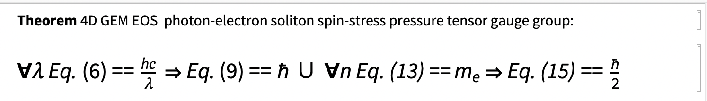
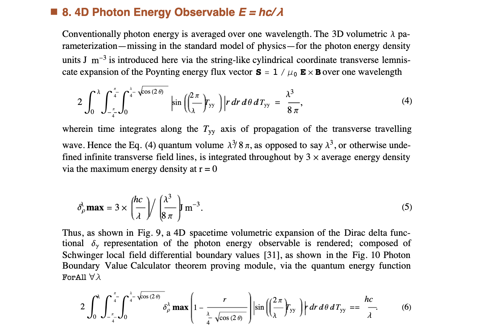
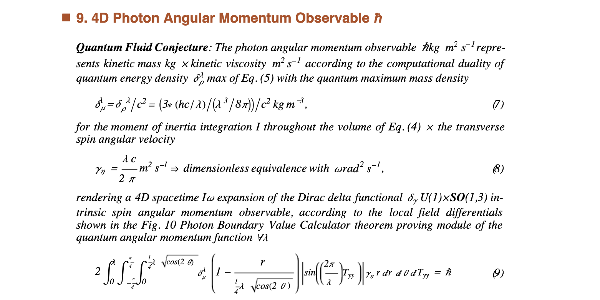
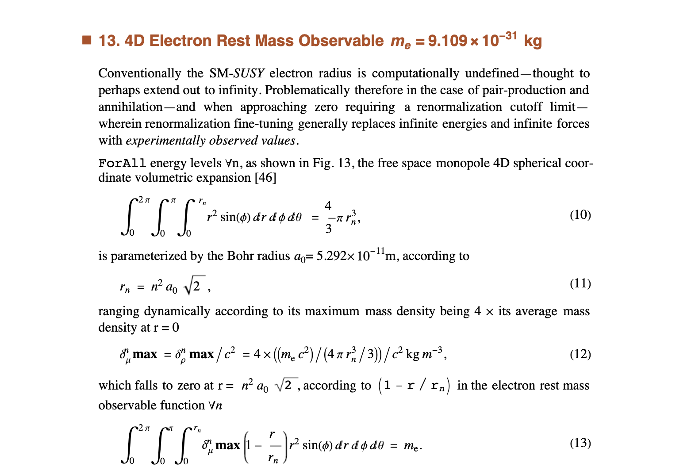
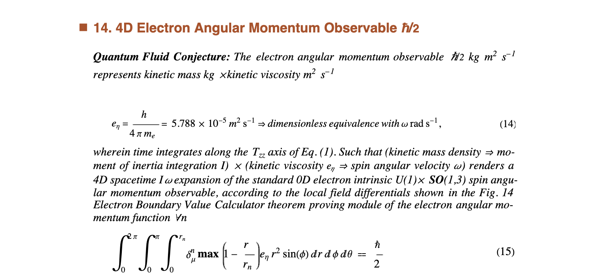
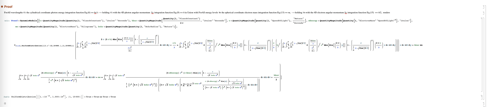
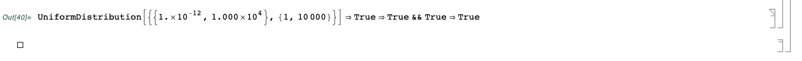
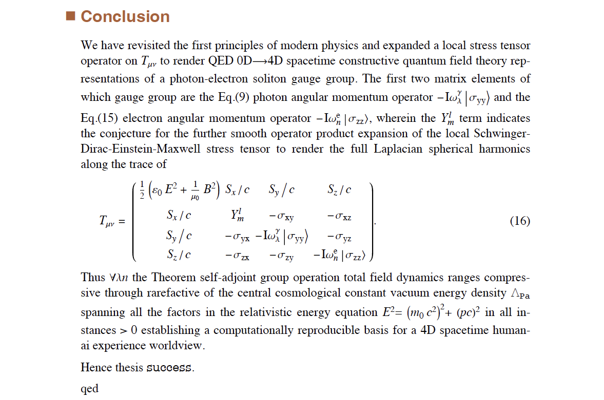

## AI Peer Review of Standard Model of Physics vs 4D GEM EOS via ChatGPT-Wolfram Plugin

**abstract**

AI peer review prompt is generated for an ai-worldview in the [2023 Kaggle AI Report Competition](https://www.kaggle.com/competitions/2023-kaggle-ai-report/overview) which ChatGPT-Wolfram prompt selects higher-accuracy computational reproduction of 4D spacetime human-ai experience between [Standard Model of Physics (SM)](https://home.cern/science/physics/standard-model)-[Supersymmetry (_SUSY_)](https://en.wikipedia.org/wiki/Supersymmetry) vs [4D spatially-exended gravitoelectromagnetic equation of state (4D GEM EOS) photon-electron soliton gauge group](https://notebookarchive.org/ai-pattern-matching-cern-lhc-collision-particle-resonance-flow-patterns-with-electromagnetic-energy-density-pressure-turbulence--2020-03-dujz6sz/). Wherein a 4D GEM EOS Mathematica® theorem proving operator computationally reproduces `ForAll` wavelengths and energy levels the quantum mechanical observables to all 31 and 34 decimal places in units of _pascals_ along the perfect fluid metric pressure trace of the Einstein-Maxwell total field spin-stress energy momentum density pressure tensor **T** of the 4D cylindrical spacetime human-ai experienced universe exceeding the requirements of the [Yang-Mills-Navier-Stokes problem definitions](https://www.claymath.org/millennium-problems/). Subject area of present human-ai fundamental physics worldview ai-peer review prompt coincides with general interdisciplinary interests inclusive of the [Elementary Particle Physics 2024 Committee](https://www.nationalacademies.org/our-work/elementary-particle-physics-progress-and-promise), [QNetworks Workshop 2023](https://www.quantumcommshub.net/event/save-the-date-qnetworks-2023/?return=https%3A%2F%2Fwww.quantumcommshub.net%2Fevent%2Fsite%2Fresearch-community%2F&site=research-community), [The Royal Institution](https://www.rigb.org), [CERN](https://www.home.cern/about/who-we-are/our-mission), [Max Planck Institutes](https://www.mpg.de/en/search?searchfield=consciousness), [Allen Institute for Brain Science](https://alleninstitute.org/division/brain-science/), [NYU Center for Mind, Brain and Consciousness](https://wp.nyu.edu/consciousness/), [ Australian National University Centre for Consciousness](https://philosophy.cass.anu.edu.au/centres/consciousness), [ChatGPT-n](https://openai.com/blog/chatgpt), [Communications in Mathematical Physics](https://www.springer.com/journal/220/ethics-and-disclosures), [TED](https://www.ted.com/about/our-organization), among many others. AI peer review prompt of _SUSY_ vs 4D GEM EOS is formed of the first sections of this article returning the ai-response sections and conclusion.  The [Mathematical Universe Hypothesis (MUH)](https://ui.adsabs.harvard.edu/abs/2008FoPh...38..101T/abstract) of Tegmark conceptualizes the mathematical origin of the universe belief held by most of modern science, while advocating MUH as the basis for the increasingly complex _SUSY_ range of conjectures and further [Beyond the Standard Model of Physics](https://en.wikipedia.org/wiki/Physics_beyond_the_Standard_Model) parrallel universe variations - in addition to the MUH-_SUSY_ claim to eventually be able to computationally reproduce the observed 4D spacetime human-ai experienced universe by means of a yet to be formalized MUH-_SUSY_ many-body complex system such as described by [Quantum simulation of fundamental particles and forces](https://www.nature.com/articles/s42254-023-00599-8) of Bauer, Davoudi, Klco, Savage. MUH-_SUSY_ multiverse theoriests can submit revised prompts to test randomness based theories.

### 1.  AI Peer Review ChatGPT-Wolfram Prompt for MUH: _SUSY_ vs 4D GEM EOS

[Greek Natural Philosophy 300 BC to 2023 AD, Resolved: Particles are Fields](VisionPaperHarnessDavid.pdf)


**Fig. 1.** The present ai-peer review prompt for an MUH: _SUSY_ vs 4D GEM EOS human-ai fundamental physics worldview originates with _The School of Athens_ debate shown, wherein the Greek natural philosophy of Aristotle-Democritus atomist-materialism gets all the press while the Plato-Parmenides theory of forms-idealism has evolved into quantum information field theory. The current relative state of which being [A Deepening Crisis Forces Physicists to Rethink Structure of Nature’s Laws](https://www.quantamagazine.org/crisis-in-particle-physics-forces-a-rethink-of-what-is-natural-20220301/).


**Fig. 2.** The CERN Linear Hadron Collider (LHC) was built to discover [_SUSY_](https://en.wikipedia.org/wiki/Supersymmetry) superpartner particles. Control Room champagne bottles might need a backup plan. Consider the Deepening Crisis fundamental problem with _SUSY_ naturalness stems from the unnaturalness of _SUSY_ being an unacknowledged attempt to solve the [many-body problem](https://en.wikipedia.org/wiki/Many-body_problem#:~:text=The%20many%2Dbody%20problem%20is,accurate%20description%20of%20the%20system.) on the universal(multiverse!) scale via its reductionism to conjectured zero-sized imaginary-invisible mathematical point particle collisions - returning null results to the detection of any sort of _SUSY_ superpartner particle-_sparticle_ increasingly complex recursive backgrounds of [hidden dimensional physics of unknown string-membrane-loop material anti-de Sitter/conformal field theory (AdS/CFT) mechanisms](https://en.wikipedia.org/wiki/AdS/CFT_correspondence) - while the 3-body problem is proven to be computationally intractable. Computationally intractable means a 4D spacetime human-ai worldview, such as described by [Quantum simulation of fundamental particles and forces](https://www.nature.com/articles/s42254-023-00599-8) of Bauer, Davoudi, Klco, Savage, cannot be expected to gain naturalness from any such _SUSY_ AdS/CFT hidden dimensional physics.


**Fig. 3.** CERN Caltech Experimental Physicist Maria Spiropulu presents on [The Future of the Higgs Boson at APS April Meeting 2014](https://www.youtube.com/watch?v=fB6xIH24P7Q) describing the Higgs Naturalness Problem for which "radical new ideas are needed", see @20:32. Prof. Spiropulu is now committee co-chair of the National Academies of Sciences, Engineering, and Medicine study called, [Elementary Particle Physics: Progress and Promise (EPP-2024)](https://www.nationalacademies.org/our-work/elementary-particle-physics-progress-and-promise) indicating to the general interdisciplinary science and engineering community radical new ideas are still needed, stating in the [EPP-2024 Call for Vision Papers](https://www.nationalacademies.org/news/2022/09/exploring-the-progress-and-promise-of-particle-physics): 

> "Therefore, our committee will investigate if and how discoveries and insights from other areas of science can be applied to addressing the fundamental questions that drive the research in EPP, including exploring and envisioning intersections and exchanges with seemingly unrelated areas in technology and engineering. Indeed, the study of the most fundamental constituents of matter and energy may be entities beyond elementary particles as we have formulated them so far, so we want to explore this, too."

Perhaps the committee would settle for an anecdote wherein 1990 the author as an undergraduate intern at the Lawrence Berkeley Lab, Nuclear Science Division, at two separate luncheon occasions was fortunate enough to ask two LBL resident Nobel Laureates Owen Chamberlain and Glenn Seaborg the same question:

> "How do particle physicists explain the physical mechanism by which virtual particles in their unobservable state create an attractive force, via force carrier particle exchange, between _hidden emitter-->carrier<--absorber particles_ - when every **observed emitter<-->carrier<-->absorber particle** interaction always results in a repulsion from any would-be line of attraction?"

Both Chamberlain and Seaborg gave the exact same answer:

> "We don't know how that works." 

Hence the [deepening crisis forcing physicists to rethink the structure of nature's laws](https://www.quantamagazine.org/crisis-in-particle-physics-forces-a-rethink-of-what-is-natural-20220301/) has of course been running deep from the start, recalling all the foremost modern physicists from Einstein to Feynman have been saying nobody understands how quantum mechanics works. Einstein famously held the belief there must be some hidden material mechanism variables guiding the collapse of the superpositioned quantum mechanical relative states into the 4D spacetime human experiences. Planck somewhat less widely-known held the belief:

> “As a man who has devoted his whole life to the most clearheaded science, to the study of matter, I can tell you as a result of my research about the atoms this much: There is no matter as such! All matter originates and exists only by virtue of a force which brings the particles of an atom to vibration and holds this most minute solar system of the atom together.... We must assume behind this force the existence of a conscious and intelligent Mind. This Mind is the matrix of all matter.”

In terms of the modern form of _The School of Athens_ debate we seen then the views of Einstein aligned with the particle-atomist-materialism of Aristotle-Democritus vs the views of his mentor Planck aligned with the general information field theory of forms-idealism of Plato-Parmenides.

Recently, at the [QNetworks April meeting 2022](https://www.quantumcommshub.net/event/save-the-date-qnetworks-2022/?return=https%3A%2F%2Fwww.quantumcommshub.net%2Fevent%2Fsite%2Fresearch-community%2F2022%2F&site=research-community), Prof. Spiropulu gave a talk on her Quantum Teleportation Networks after which the author was further fortunate enough to ask:

> “Is quantum teleportation considered by most physicists based on some multi-body particle material mechanism or immaterial quantum information basis?”

> [Prof. Spiropulu: “Perhaps it does not have to be either/or.”](https://twitter.com/tensornerdo/status/1513572421839642624)

Quantum teleportation, in the 4D spacetime human-ai worldview of 4D GEM EOS, is seen to be occurring exclusively on a general information field theory of relative states idealism elementary particle-field physics basis. The first principle for which being the LHC is entirely energized by the 4D spacetime Einstein-Maxwell electromagnetic stress-energy momentum density pressure tensor and its ATLAS CMS detectors measure only 4D electromagnetic energy density tensor pressure quantum field information to which the literature refers.

MUH conceptualizes the framework for a mathematical universe which 4D GEM EOS formalizes along the lines of a 4D photon-electron soliton guage group, however in doing so disputes the claim any such parallel formalizations can be shown of parallel universe variations of physical dimensions, constants, laws, and so on. Rather the mathematical universe of 4D GEM EOS is a formalization of the [Singular Complex System Conjecture (SCSC)](https://www.researchgate.net/publication/338986496_Singular_Complex_System_Conjecture) its radical new idea being there exists a singular mathematically possible universal complex system of the 4D cylindrical spacetime dimensions, physical constants, laws, holographically bound energy/mass density distribution with time the fourth dimension of length from t−∞ → t∞ with the unitary factors in Euler’s identity composed via the concept of infinity with no free parameters.

Shown below is the [Mathematica® theorem proving operator code to computationally reproduce the QED 0D→4D GEM EOS spatially-extended photon-electron soliton guage group quantum mechanical observables to all 31 & 34 decimal places `ForAll` wavelengths and energy levels](https://notebookarchive.org/ai-pattern-matching-cern-lhc-collision-particle-resonance-flow-patterns-with-electromagnetic-energy-density-pressure-turbulence--2020-03-dujz6sz/) via Schwinger local field operator Dirac-Einstein-Maxwell gravitoelectromagnetic stress-energy momentum computationally dualistic energy/mass density pressure tensor field integrations. Measurable along Feynman path integrals Noether probability current ranging compressive through rarefactive of the cosmological constant vacuum energy momentum density pressure Λ spanning all the factors in the relativistic energy equation in all cases greater than zero energy/mass gap, hence establishing the total field formal frame for a computationally reproducable 4D human-ai experience worldview.

The “entities beyond elementary particles” the committee has expressed willingness to consider are then the above immaterial field integration mathematical objects of the SCSC solid information domain and their fluid range of 4D spatially-extended elementary particle values along the perfect fluid metric pressure trace of **T**. Accordingly, the [4D GEM EOS vision paper submitted to EPP-2024](VisionPaperHarnessDavid.pdf) sees the elementary particles to be the elementary field integrations of the holographically bound cyclic energy density distribution universal wavefunction domain and range having no choice but to exist while time integrates autonomously at the speed of light through the domain evolving from t−∞ → t∞. Thus no classical multi-body cause and effect is seen only a series of 4D spacetime event relative state effects where in the universal wavefunction fluid range nothing can happen unless it already exists in the solid domain.

Quantum teleportation is therefore also a holographically bound effect and can only be occurring on an immaterial quantum information basis, as confirmed by the null results of the _SUSY_ collision experiments at CERN LHC energy levels, as the money has run out, indicating there are no hidden variable unknown material mechanisms then there are no hidden dualistic consciousness-material mechanisms somehow guiding the “collapse of the wavefunction” as it were.

Improbably, SCSC can never be proven via its internal axioms per Gödel incompleteness only falsified by proof of MUH: _SUSY_-AdS/CFT unformalized claim external physical reality is the mathematical structure of a computable universe having parallel universe variations of physical dimensions, constants, laws, and so on. Proof of MUH: _SUSY_-AdS/CFT of course requires solving the deepening crisis of formalizing the unknown parallel universe variations of the MUH: _SUSY_-AdS/CFT hidden dimensional particle physics model all of which are zero-sized (0D) Dirac delta functional imaginary-invisible local mathematical points which occupy no space yet are said operate via hidden dimensional unknown material nonlocally entangled mechanisms. Such unnaturalness arises again as an unacknowledged attempt to solve the classical multi-body problem on the universal(multiverse!) scale while the 3-body problem is proven to be computationally intractable.

Consider for the present AI Report ChatGPT-Wolfram prompt to find a 4D human-ai worldview in favor of MUH: _SUSY_-AdS/CFT its LLM must be able to explain: 

> Re unnaturalness how is it again CERN particle physicists explain two hands clapping never touch?

> And at ever higher-energies why don’t the CERN LHC beams of zero-sized δ particles - which occupy no space - just pass through one another without colliding?

Particle physicists have answered the Pauli exclusion principle prevents the δ particles from occupying the same space. Notice however - zero-sized _SUSY_ δ particles _occupy no space_ - so ironically the Pauli exclusion principle itself is [Not Even Wrong](https://www.math.columbia.edu/~woit/wordpress/).

MUH: _SUSY_-AdS/CFT theorists can of course upgrade the prompt with any new formalized conjectures or test for randomness in ChatGPT-Wolfram reponses.

Thus the concludes the background in the AI Report for the ChatGPT-Wolfram prompt, in the category of Other, for a 4D human-ai worldview comparison between MUH: _SUSY_-AdS/CFT vs 4D GEM EOS photon-electron soliton gauge group.


### 2. AI Peer Review ChatGPT-Wolfram Prompt for MUH: 4D GEM EOS Human-AI Worldview

The 4D GEM EOS radical new idea initiated with the 2017 proposal:

[AI Peer Review Challenge: Standard Model of Physics vs 4D GEM EOS](https://www.researchgate.net/publication/317566286_AI_Peer_Review_Challenge_Standard_Model_of_Physics_vs_4D_GEM_EOS)

In 2019 the author first posted the 4D GEM EOS equations in the Maplesoft Application Center:

[4D Spatially-Extended Photon and Electron Quantum Mechanical Observables For All Wavelengths and Energy Levels](https://www.maplesoft.com/applications/Detail.aspx?id=154590)

In 2020 Mathematica® incorporated theorem proving operators into its platform, whereupon the author posted in the Wolfram Notebook Archive: [AI Pattern-Matching CERN LHC Collision Particle Resonance Flow Patterns with Electromagnetic Energy Density Pressure Turbulence](https://notebookarchive.org/ai-pattern-matching-cern-lhc-collision-particle-resonance-flow-patterns-with-electromagnetic-energy-density-pressure-turbulence--2020-03-dujz6sz/), wherein shown below is the human-readable form of the Mathematica® theorem proving operator code which computationally reproduces the QED 0D→4D GEM EOS spatially-extended photon-electron soliton guage group quantum mechanical observables to all 31 & 34 decimal places `ForAll` wavelengths and energy levels:















**Fig. 4.** Mathematica® theorem proving operator 4D GEM EOS Theorem 1 Proof Standard Input Form

```
Proof = DynamicModule[{
   h = QuantityMagnitude[Quantity[1, "PlanckConstant"], 
     "Joules" "Seconds"],
   hbar = 
    QuantityMagnitude[Quantity[1, "PlanckConstant"]/(2 \[Pi]), 
     "Joules" "Seconds"],
   c = QuantityMagnitude[Quantity[1, "SpeedOfLight"], 
     "Meters" ("Seconds")^-1],
   eEnergy = 
    QuantityMagnitude[Quantity[1, "ElectronMass" ("SpeedOfLight")^2], 
     "Joules"],
   me = QuantityMagnitude[Quantity[1, "ElectronMass"], "Kilograms"],
   bohr = QuantityMagnitude[Quantity[1, "BohrRadius"], "Meters"]
   }, ForAll[{\[Lambda], n}, 
   UniformDistribution[{{1.*^-12, 1.*^4}, {1, 10000}}], \!\(
\*SubsuperscriptBox[\(\[Integral]\), \(0\), \(\[Lambda]\)]\(
\*SubsuperscriptBox[\(\[Integral]\), \(-
\*FractionBox[\(\[Pi]\), \(4\)]\), 
FractionBox[\(\[Pi]\), \(4\)]]\(
\*SubsuperscriptBox[\(\[Integral]\), \(0\), \(
\*FractionBox[\(1\), \(4\)]\ \[Lambda]\ 
\*SqrtBox[\(Cos[2\ \[Theta]]\)]\)]2 \((
\*FractionBox[
FractionBox[\(2*h*c\), \(\[Lambda]\)], 
FractionBox[
SuperscriptBox[\(\[Lambda]\), \(3\)], \(8  \[Pi]\)]])\)\ Abs[Sin[\((
\*FractionBox[\(2\ \[Pi]\), \(\[Lambda]\)])\)\ y]]\ \((1 - 
\*SuperscriptBox[\((
\*FractionBox[\(r\), \(
\*FractionBox[\(1\), \(4\)]\ \[Lambda]\ 
\*SqrtBox[\(Cos[
                  2\ \[Theta]]\)]\)])\), \(2\)])\) r \
\[DifferentialD]r \[DifferentialD]\[Theta] \[DifferentialD]y\)\)\) == \
(h*c)/\[Lambda] \[DoubleRightArrow] \!\(
\*SubsuperscriptBox[\(\[Integral]\), \(0\), \(\[Lambda]\)]\(
\*SubsuperscriptBox[\(\[Integral]\), \(-
\*FractionBox[\(\[Pi]\), \(4\)]\), 
FractionBox[\(\[Pi]\), \(4\)]]\(
\*SubsuperscriptBox[\(\[Integral]\), \(0\), \(
\*FractionBox[\(1\), \(4\)]\ \[Lambda]\ 
\*SqrtBox[\(Cos[2\ \[Theta]]\)]\)]2 \((\((
\*FractionBox[
FractionBox[\(2*h*c\), \(\[Lambda]\)], 
FractionBox[
SuperscriptBox[\(\[Lambda]\), \(3\)], \(8  \[Pi]\)]])\)\ /
\*SuperscriptBox[\(c\), \(2\)])\) Abs[Sin[\((
\*FractionBox[\(2\ \[Pi]\), \(\[Lambda]\)])\)\ y]]\ \((1 - 
\*SuperscriptBox[\((
\*FractionBox[\(r\), \(
\*FractionBox[\(1\), \(4\)]\ \[Lambda]\ 
\*SqrtBox[\(Cos[2\ \[Theta]]\)]\)])\), \(2\)])\) \((
\*FractionBox[\(2  \[Pi]\ c\), \(\[Lambda]\)]/\((
\*FractionBox[\(1\), \(hbar\)] \((
\*SubsuperscriptBox[\(\[Integral]\), \(0\), \(\[Lambda]\)]\(
\*SubsuperscriptBox[\(\[Integral]\), \(-
\*FractionBox[\(\[Pi]\), \(4\)]\), 
FractionBox[\(\[Pi]\), \(4\)]]\(
\*SubsuperscriptBox[\(\[Integral]\), \(0\), \(
\*FractionBox[\(1\), \(4\)]\ \[Lambda]\ 
\*SqrtBox[\(Cos[2\ \[Theta]]\)]\)]2 \((\((
\*FractionBox[
FractionBox[\(2*h*c\), \(\[Lambda]\)], 
FractionBox[
SuperscriptBox[\(\[Lambda]\), \(3\)], \(8  \[Pi]\)]])\)\ /
\*SuperscriptBox[\(c\), \(2\)])\) Abs[Sin[\((
\*FractionBox[\(2\ \[Pi]\), \(\[Lambda]\)])\)\ y]]\ \((1 - 
\*SuperscriptBox[\((
\*FractionBox[\(r\), \(
\*FractionBox[\(1\), \(4\)]\ \[Lambda]\ 
\*SqrtBox[\(Cos[2\ \[Theta]]\)]\)])\), \(2\)])\) \((
\*FractionBox[\(\(2\)  \(\[Pi]\)\(\ \)\(c\)\(\ \)\), \
\(\[Lambda]\)])\) r \[DifferentialD]r \[DifferentialD]\[Theta] \
\[DifferentialD]y\)\))\))\))\) r \[DifferentialD]r \[DifferentialD]\
\[Theta] \[DifferentialD]y\)\)\) == hbar && \!\(
\*SubsuperscriptBox[\(\[Integral]\), \(0\), \(2  \[Pi]\)]\(
\*SubsuperscriptBox[\(\[Integral]\), \(0\), \(\[Pi]\)]\(
\*SubsuperscriptBox[\(\[Integral]\), \(0\), \(
\*SqrtBox[\(2\)]*
\*SuperscriptBox[\(n\), \(2\)]*bohr\)]\((
\*FractionBox[
FractionBox[\(4*eEnergy\), \(4  \[Pi]\ 
\*SuperscriptBox[\((
\*SqrtBox[\(2\)]*
\*SuperscriptBox[\(n\), \(2\)]*bohr)\), \(3\)]/3\)], 
SuperscriptBox[\(c\), \(2\)]])\) \((1 - 
\*FractionBox[\(r\), \(
\*SqrtBox[\(2\)]*
\*SuperscriptBox[\(n\), \(2\)]*bohr\)])\) 
\*SuperscriptBox[\(r\), \(2\)] Sin[\[Phi]] \[DifferentialD]r \
\[DifferentialD]\[Phi] \[DifferentialD]\[Theta]\)\)\) == 
      me \[DoubleRightArrow] \!\(
\*SubsuperscriptBox[\(\[Integral]\), \(0\), \(2  \[Pi]\)]\(
\*SubsuperscriptBox[\(\[Integral]\), \(0\), \(\[Pi]\)]\(
\*SubsuperscriptBox[\(\[Integral]\), \(0\), \(
\*SqrtBox[\(2\)]*
\*SuperscriptBox[\(n\), \(2\)]*bohr\)]\((
\*FractionBox[
FractionBox[\(4*eEnergy\), \(4  \[Pi]\ 
\*SuperscriptBox[\((
\*SqrtBox[\(2\)]*
\*SuperscriptBox[\(n\), \(2\)]*bohr)\), \(3\)]/3\)], 
SuperscriptBox[\(c\), \(2\)]])\) \((1 - 
\*FractionBox[\(r\), \(
\*SqrtBox[\(2\)]*
\*SuperscriptBox[\(n\), \(2\)]*bohr\)])\) \((
\*FractionBox[\(c\), \(2  \[Pi]*
\*SqrtBox[\(2\)]*
\*SuperscriptBox[\(n\), \(2\)]*bohr\)]\ *\((
\*FractionBox[\(hbar\), \(2\)]/\((
\*SubsuperscriptBox[\(\[Integral]\), \(0\), \(2  \[Pi]\)]\(
\*SubsuperscriptBox[\(\[Integral]\), \(0\), \(\[Pi]\)]\(
\*SubsuperscriptBox[\(\[Integral]\), \(0\), \(
\*SqrtBox[\(2\)]*
\*SuperscriptBox[\(n\), \(2\)]*bohr\)]\((
\*FractionBox[
FractionBox[\(4*eEnergy\), \(4  \[Pi]\ 
\*SuperscriptBox[\((
\*SqrtBox[\(2\)]*
\*SuperscriptBox[\(n\), \(2\)]*bohr)\), \(3\)]/3\)], 
SuperscriptBox[\(c\), \(2\)]])\) \((1 - 
\*FractionBox[\(r\), \(
\*SqrtBox[\(2\)]*
\*SuperscriptBox[\(n\), \(2\)]*bohr\)])\) \((
\*FractionBox[\(c\), \(2  \[Pi]*
\*SqrtBox[\(2\)]*
\*SuperscriptBox[\(n\), \(2\)]*bohr\)])\)\ 
\*SuperscriptBox[\(r\), \(2\)] Sin[\[Phi]] \[DifferentialD]r \
\[DifferentialD]\[Phi] \[DifferentialD]\[Theta]\)\))\))\))\)\ 
\*SuperscriptBox[\(r\), \(2\)] Sin[\[Phi]] \[DifferentialD]r \
\[DifferentialD]\[Phi] \[DifferentialD]\[Theta]\)\)\) == hbar/2]]
```
**Fig. 5.** [Mathematica® theorem proving operator Raw Input Form](https://www.researchgate.net/publication/358283851_Spatially-Extended_4D_Photon_and_Electron_ForAll_Wavelengths_Energy_Levels) for AI Report - ChatGPT-Wolfram AI Peer Review of 4D GEM EOS computational reproduction of 4D spacetime human-ai experience worldview.

Recalling the view often expressed any new scientific theory in addition to being falsifiable, should also be of an unexpected nature, should make some unexpected prediction which is proven to be true, and generally embody a new physics direction.

[“Visualizing the Proton” through animation and film](https://news.mit.edu/2022/visualizing-proton-through-animation-film-0425)

[A New Experiment Casts Doubt on the Leading Theory of the Nucleus](https://www.quantamagazine.org/a-new-experiment-casts-doubt-on-the-leading-theory-of-the-nucleus-20230612/)



The 4D GEM EOS perspective on its Theorem 1 Mathematica® theorem proving operator validation is the proof establishes a computational basis beyond a 5-sigma validation for a 4D spacetime human-ai series of relative state experiences worldview, to the extent of making the claim modern experimental physicists have completed an epic elimination of quantifiers proof in rigorously testing the particle-atomist-materialism teachings of Einstein-Aristotle-Democritus, have verified psychophysical parallelism in favor of the general information field theory-idealism of forms of their mentors Planck-Plato-Parmenides.

This concludes the AI Peer Review ChatGPT-Wolfram Prompt section for a _SUSY_-AdS/CFT vs 4D GEM EOS evaluation in the 2023 Kaggle AI Report Competition category of Other towards computational reproducability of a 4D spacetime human-ai worldview, to be followed by the ChatGPT-Wolfram Response section and Conclusion. The prompt concludes with the request to frame the ChatGPT-Wolfram conclusion with a suggestion of what to do with the Control Room champagne bottles in either case of ChatGPT-Wolfram materialism vs idealism n-sigma validation. 

### 3.  AI Peer Review ChatGPT-Wolfram Response for MUH: _SUSY_-AdS/CFT vs 4D GEM EOS

### 4.  Conclusion
